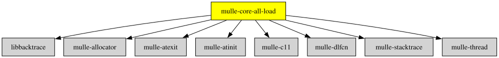

# mulle-core-all-load

#### 🛸 mulle-core-all-load does something

Force-linkable amalgamated library for mulle-core initialization libraries


| Release Version                                       | Release Notes  | AI Documentation
|-------------------------------------------------------|----------------|---------------
|  [](//github.com/mulle-core/mulle-core-all-load/actions) | [RELEASENOTES](RELEASENOTES.md) | [DeepWiki for mulle-core-all-load](https://deepwiki.com/mulle-core/mulle-core-all-load)


## Documentation & Guides

* [API Summary](asset/dox/api/toc)


### You are here




## Add

There are various methods how to get mulle-core-all-load into your project.
One common denominator is that you will
`#include <mulle-core-all-load/mulle-core-all-load.h>` in your sources and link
with `-lmulle-core-all-load`.


### Add as a dependency with mulle-sde

Use [mulle-sde](//github.com/mulle-sde) to add mulle-core-all-load to your project:

``` sh
mulle-sde add github:mulle-core/mulle-core-all-load
```

This library does not include [mulle-atinit](//github.com/mulle-core/mulle-atinit)
and [mulle-atexit](//github.com/mulle-core/mulle-atexit) and
[mulle-testallocator](//github.com/mulle-core/mulle-testallocator). If you
add these libraries, it is important that mulle-core is added before them.


To only add the sources of mulle-core-all-load with dependency
sources use [clib](https://github.com/clibs/clib):


### Add sources to your project with clib

``` sh
clib install --out src/mulle-core mulle-core/mulle-core-all-load
```

Add `-isystem src/mulle-core` to your `CFLAGS` and compile all the
sources that were downloaded with your project. (In **cmake** add
`include_directories( BEFORE SYSTEM src/mulle-core)` to your `CMakeLists.txt`
file).


### Add as subproject with cmake and git

[mulle-core](//github.com/mulle-core/mulle-core) is **not** bundled
with mulle-core-all-load. Add both as sibling git submodules:

``` bash
git submodule add https://github.com/mulle-core/mulle-core.git stash/mulle-core
git submodule add https://github.com/mulle-core/mulle-core-all-load.git stash/mulle-core-all-load
git submodule update --init
```

Note that `--recursive` is neither needed nor wanted, mulle-core-all-load contains
no submodules of its own.

Add this to your `CMakeLists.txt`:

``` cmake
add_subdirectory( stash/mulle-core)
add_subdirectory( stash/mulle-core-all-load)
target_link_libraries( ${PROJECT_NAME} PRIVATE mulle-core-all-load)
```

`add_subdirectory( mulle-core)` must come **before**
`add_subdirectory( mulle-core-all-load)`, because mulle-core-all-load depends on
the `mulle-core` target and its headers.

mulle-core-all-load is a **force-linkable** initialization library: it registers
`atinit`/`atexit` callbacks that must end up in your binary even if no symbol of
the library is referenced directly. The target created by `add_subdirectory`
carries the necessary `INTERFACE` force-link options, so the
`target_link_libraries( ${PROJECT_NAME} PRIVATE mulle-core-all-load)` above is
sufficient. When linking mulle-core-all-load as an installed static library
instead, force-link it explicitly:

``` sh
# Linux (GCC/Clang)
-Wl,--whole-archive -lmulle-core-all-load -Wl,--no-whole-archive

# macOS
-force_load libmulle-core-all-load.a

# Windows (MSVC)
/WHOLEARCHIVE:mulle-core-all-load.lib
```


## Install

Use [mulle-sde](//github.com/mulle-sde) to build and install mulle-core-all-load and all dependencies:

``` sh
mulle-sde install --prefix /usr/local \
   https://github.com/mulle-core/mulle-core-all-load/archive/latest.tar.gz
```

### Legacy Installation

Install the requirements:

| Requirements                                 | Description
|----------------------------------------------|-----------------------
| [libbacktrace](https://github.com/mulle-core/libbacktrace)             | A C library that may be linked into a C/C++ program to produce symbolic backtraces
| [mulle-c11](https://github.com/mulle-c/mulle-c11)             | 🔀 Cross-platform C compiler glue (and some cpp conveniences)
| [mulle-allocator](https://github.com/mulle-c/mulle-allocator)             | 🔄 Flexible C memory allocation scheme
| [mulle-thread](https://github.com/mulle-concurrent/mulle-thread)             | 🔠 Cross-platform thread/mutex/tss/atomic operations in C
| [mulle-dlfcn](https://github.com/mulle-core/mulle-dlfcn)             | ♿️ Shared library helper

Download the latest [tar](https://github.com/mulle-core/mulle-core-all-load/archive/refs/tags/latest.tar.gz) or [zip](https://github.com/mulle-core/mulle-core-all-load/archive/refs/tags/latest.zip) archive and unpack it.

Install **mulle-core-all-load** into `/usr/local` with [cmake](https://cmake.org):

``` sh
PREFIX_DIR="/usr/local"
cmake -B build                               \
      -DMULLE_SDK_PATH="${PREFIX_DIR}"       \
      -DCMAKE_INSTALL_PREFIX="${PREFIX_DIR}" \
      -DCMAKE_PREFIX_PATH="${PREFIX_DIR}"    \
      -DCMAKE_BUILD_TYPE=Release &&
cmake --build build --config Release &&
cmake --install build --config Release
```


## Author

[Nat!](https://mulle-kybernetik.com/weblog) for Mulle kybernetiK  


